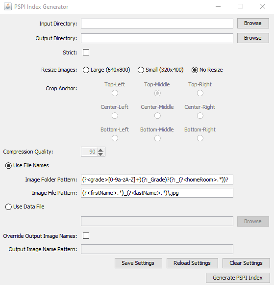

# PSPI Index Generator

A Java command line and GUI application for generating photo packages that adhere to the 
[Digital Data & Image Format and Usage Guidelines For School Photography & Yearbook Publication 
(Version 2017-2018)](https://yearbookdiscoveries.com/wp-content/uploads/2018/08/PSPI-Guidelines-2017-2018.pdf) 
as specified by [Professional School & Sports Photographers International (PSPI)](https://yearbookdiscoveries.com/pspi-guidelines-school-photographer-portrait-cds-2/).

## Software Requirements

The machine that will run this software requires [Java version 11 or higher](https://java.com/en/).

## Usage

### Graphic User Interface (GUI)

You can run the jar without any commands if you want to start up the Graphic user interface (GUI), like this:

```
/path/to/java -jar pspi-index-generator-1.3.0.jar
```

Here is what it looks like:



### Command-Line Interface (CLI)

Otherwise you can run the command with "-h" to view the usage menu, like this:

```
/path/to/java -jar pspi-index-generator-1.3.0.jar -h
```

And here is the expected output:

```
usage: java -jar pspi-index-generator.jar [-a] [-c <(top|center|bottom)-(left|middle|right)>] [-d <dataFile>] [-f] [-h] [-i
       <inputDir>] [-o <outputDir>] [-p <outputPattern>] [-q <0.0-1.0>] [-r <SMALL|LARGE>] [-s] [-v]
PSPI Index Generator

Example:
    java -jar pspi-index-generator.jar -i inputDir -o outputDir -r SMALL -c center-middle -q 0.9

 -a,--append                                                  Append data to existing PSPI output directory
 -c,--crop-anchor <(top|center|bottom)-(left|middle|right)>   When -r is specified, this value is used to override the
                                                              default crop anchor, which is: top-middle
 -d,--data-file <dataFile>                                    Location of input data file
 -f,--force                                                   Force overwrite of existing output directory
 -h,--help                                                    Prints this message
 -i,--input-dir <inputDir>                                    Location of input directory
 -o,--output-dir <outputDir>                                  Location of output directory
 -p,--output-pattern <outputPattern>                          Change output file names
 -q,--quality <0.0-1.0>                                       Compression quality level to use when images are manipulated
                                                              (crop or resize).  Values range is 0.0-1.0, where 0.0 is least
                                                              quality and 1.0 is highest quality.  Default value is 0.7
 -r,--resize-images <SMALL|LARGE>                             Automatically resizes images to standard PSPI size
                                                              specifications.  Acceptable values are "SMALL" for 320x400px or
                                                              "LARGE" for 640x800px.
 -s,--strict                                                  Fails on unexpected files
 -v,--verbose                                                 Enables verbose logging
```